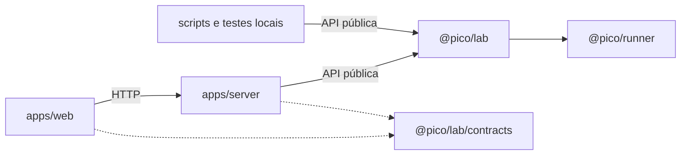

# Arquitetura de código do Pico

Estado: refatoração integral implementada em quatro workspaces. O código antigo
em `src/` foi removido; API, tools, UI, scripts e testes usam a organização abaixo.
As decisões e os contraexemplos das revisões estão em
[architecture-review.md](architecture-review.md). O domínio e a jornada do
produto estão em [architecture.md](architecture.md).

## Pacotes e aplicações

```text
apps/
  server/                  @pico/server — HTTP, assets e sinais do processo
  web/                     @pico/web — React, navegação e cliente HTTP
packages/
  lab/                     @pico/lab — pesquisa e conversa duráveis
  runner/                  @pico/runner — execução e observações operacionais
scripts/                   Comandos locais pelas APIs públicas
examples/                  Protocolos e código experimental preservável
tests/                    Verificação entre workspaces (sem acesso privado)
```



O lab funciona sem HTTP e o runner funciona sem lab, Pi ou dados científicos.
Não há requisito de publicar os pacotes ou separar serviços em deploys.
Todos os workspaces são privados, exportam fontes TypeScript e compartilham o
lockfile da raiz. Backend e workers executam com Bun; Vite compila a web.

| Import público | Entrada | Responsabilidade |
| --- | --- | --- |
| `@pico/lab` | `packages/lab/src/lab-runtime.ts` | Construção e capacidades do laboratório |
| `@pico/lab/contracts` | `packages/lab/src/contracts.ts` | Tipos e schemas serializáveis para consumidores |
| `@pico/lab/administration` | `packages/lab/src/lab-administration.ts` | Backup offline, restore e preparação do CLI Pi |
| `@pico/runner` | `packages/runner/src/runner.ts` | Execução, inventário, arquivos e tipos operacionais |
| `@pico/server` | `apps/server/src/server.ts` | Adaptador HTTP com lifecycle testável sem abrir porta |

`exports` enumera entradas, sem wildcards. A web importa somente o subpath de
contratos. Esse subpath isola o código e os tipos alcançados pelo navegador;
não separa a instalação das dependências do manifest do lab. Um cliente
instalado independentemente justificaria extrair contratos para outro pacote.

`models`, `sources`, `storage` e `pico` permanecem módulos do lab: não têm outro
consumidor independente. Não há pacotes genéricos `core`, `shared` ou `utils`,
nem um pacote por entidade. Runner tem lifecycle, formato e execução próprios.

## Onde encontrar o código

A árvore destaca os pontos de entrada e as divisões existentes; arquivos de
implementação menores ficam ao lado do assunto que atendem. Nomes de arquivos
usam `kebab-case`; tipos/componentes usam `PascalCase`, funções `camelCase`.

```text
apps/server/src/
  main.ts                         Porta, assets, sinais e watch
  server.ts                       Admissão/drenagem das requisições
  http/
    api.ts                        Composição das rotas
    request-context.ts            Origem, body, autoria e chave de intenção
    responses.ts                  JSON, erros e downloads
    labs-routes.ts
    research-routes.ts
    conversation-routes.ts
    experiments-routes.ts
    runs-routes.ts
    library-routes.ts
    models-routes.ts
    backup-routes.ts

apps/web/src/
  main.tsx
  app/
    app.tsx                       Composição e laboratório selecionado
    app-shell.tsx                 Layout e navegação
    navigation.ts                 URLs, sem importar páginas
    laboratory-queries.ts         Metadados leves do laboratório
    theme.ts
    error-boundary.tsx
  api/
    http-client.ts                Transporte e erros
    use-poll.ts                   Visibilidade, polling e dados desatualizados
    use-mutation.ts               Intenção, retry e chave idempotente
  components/                     Markdown, formulários e elementos comuns
  styles/                         Tokens, base, shell e responsividade
  features/
    chat/                         Conversa, rascunhos, mensagens e composição
    overview/                     Perguntas, conclusões e projeções
    experiments/                  Workspace, runs, métricas, logs e comparação
    library/                      Fontes, datasets e formulários
    settings/                     Criação do lab, configurações e modelo

packages/lab/src/
  lab-runtime.ts
  lab-administration.ts
  contracts.ts                    Exports nomeados, seguros no navegador
  contracts/                      Contratos/schemas por assunto
    record-metadata.ts
    json.ts
    validation.ts
    labs.ts
    research.ts
    experiments.ts
    library.ts
    conversation.ts
    models.ts
    sources.ts
    views.ts
    http.ts
  runtime/
    application.ts                Composição e lifecycle
    runtime-contract.ts           Capacidades públicas explícitas
    admission.ts                  Barreira e drenagem de operações aceitas
    paths.ts                      Dados, perfil Pi e runtime
    backup.ts                     Coordenação administrativa online/offline
  research/
    laboratory.ts                 Composição científica e fachada Research
    persistence.ts                Capacidades restritas dos repositórios
    mutations.ts                  Autoria, revisão, evento e recibo atômicos
    labs.ts
    questions.ts
    hypotheses.ts
    experiments.ts
    runs.ts                       Invariantes científicas da tentativa
    results.ts
    conclusions.ts
    evidence.ts                   Referências verificadas a métricas/artefatos
    datasets.ts
    papers.ts
    workspace.ts
    notebook.ts                   Resumo e histórico público paginado
    queries.ts                    Projeções comuns a Pico e UI
    operations.ts                 Composição dos efeitos e reconciliação
    effects.ts                    Reserva, deduplicação e recuperação
    execution.ts                  Lab ↔ runner e run-records científicos
    run-projection.ts              Projeção operacional → SQLite
    run-state.ts
    errors.ts
  pico/
    session.ts                    Fila de turnos por laboratório
    turn.ts                       Loop de modelo/tools, orçamento e retomada
    transcript.ts                 Respostas, calls e avanço de turno atômicos
    context.ts                    Contexto limitado, sem cortar grupos nativos
    completion-events.ts          Consumo durável e deduplicado de término
    instructions.ts
    demo-narrator.ts               Narração simulada, operações reais
    tools/
      catalog.ts
      tool-definition.ts
      research-tools.ts
      experiment-tools.ts
      library-tools.ts
      notebook-tools.ts
  models/
    model-contract.ts             Porta de inferência e envelope nativo opaco
    model-gateway.ts              Composição e lifecycle dos provedores
    pi-runtime.ts                 Catálogo, autenticação e SDK Pi
    pi-adapter.ts                 Protocolo e replay nativos
    pi-profile.ts                 Perfil exclusivo do Pico
    openai-compatible.ts          Chat Completions
  sources/
    source-access.ts               Busca/importação/leitura e cancelamento
    crossref.ts
    web-client.ts                 Cliente do processo auxiliar
    web-worker.ts                 Host isolado da extensão pi-web-access
    web-protocol.ts
    web-config.ts
    pdf-reader.ts
  storage/
    storage.ts                    Composição dos repositórios concretos
    database.ts
    records.ts                    Primitivas internas de SQLite
    research-repository.ts
    conversation-repository.ts
    operation-repository.ts
    research-files.ts             Datasets/workspaces e run-records
    backup.ts                     Manifesto, verificação e restore
    application-lock.ts
    canonical-json.ts
    errors.ts
    migrations/
      migrate.ts
      001-durable-laboratory.ts

packages/runner/src/
  runner.ts                       API e lifecycle do controlador
  execution-contract.ts           Comandos e observações operacionais
  format-v1.ts                    Leitor/writer do formato histórico
  execution-files.ts              Arquivos de estado e controle
  coordinator-lock.ts             Exclusão por raiz operacional
  queue.ts
  recovery.ts
  snapshots.ts
  archives.ts
  files.ts                        Acesso limitado e hashes
  processes.ts                    Identidade e verificação de grupos
  worker.ts                       Supervisor durável
  watchdog.ts                     READY/GO, prazo e morte do grupo
  outputs.ts                      Logs, métricas e artefatos observados
```

As consultas de cada página ficam na própria feature. `app/navigation.ts` é
tratado como módulo independente da composição: páginas podem criar links sem
importar `app.tsx`. Features não importam outras features. Estilos locais ficam
junto dos componentes; regras globais ficam em `styles`.

## Fronteiras e dependências

As regras incluem imports de tipos e reexports. Aliases globais únicos em
`tsconfig.base.json` são herdados pelos workspaces e reproduzidos no Vite:
`@/lab/*`, `@/runner/*`, `@/server/*`, `@/web/*`. Cada workspace usa seu próprio
prefixo internamente; entre workspaces, somente nomes e exports públicos.
Não existe alias genérico `@/*` apontando para árvores diferentes.

| Consumidor | Pode depender de |
| --- | --- |
| `contracts` | Outros contratos e Zod; nenhum runtime, React, Node/Bun ou SDK |
| `server/http` | Capacidades públicas do lab e seus contratos |
| `web/features/*` | Própria feature, API, componentes, navegação e contratos |
| `pico/tools` | Fachada Research, contratos e protocolo técnico de tool |
| Outros arquivos de `pico` | Research, contrato/gateway de models, conversa e recibos restritos |
| `research` | Repositórios/arquivos de storage, contratos, API do runner e SourceAccess |
| `models` | Contratos e SDKs de inferência; nenhuma sessão ou persistência científica |
| `sources` | Contratos de busca, clientes/SDKs de conteúdo e configuração própria |
| `storage` | Contratos, SQLite/filesystem e helpers operacionais exportados por runner |
| `runtime` | Entradas necessárias para construir e conectar os módulos |
| `runner` | SO, filesystem e implementação própria; nenhum código ou tipo do lab |

`storage` reutiliza `fileAccess` e os nomes dos arquivos de controle exportados
por `@pico/runner` para aplicar a mesma política de arquivos e backup. Essa
aresta é explícita; não permite ao runner escrever registros científicos.
`storage/storage.ts`, conexão, backup e locks são entradas de composição;
pesquisa recebe capacidades restritas, declaradas em `research/persistence.ts`.
Não há Store genérico na API pública.

A matriz executável está em `tests/architecture/module-policy.ts`. O teste de
fronteiras resolve módulos com o TypeScript real, verifica tipos/reexports,
imports privados, aliases e ciclos. O consumidor em
`tests/architecture/browser-contracts` usa ambiente de navegador sem Bun/Node;
`tests/architecture/browser-web` compila a UI sem os tipos Node da configuração Vite.
Scripts/testes da raiz consomem APIs públicas; testes privados ficam no workspace.
A checagem cobre imports estáticos/literais e tipos; carregamentos arbitrários
por strings ficam fora dessa prova. A API AST experimental do TypeScript está
fixada em 7.0.2, com fixtures negativas para validar atualizações.

## Estado, lifecycle e recuperação

`createLabRuntime` constrói capacidades sem iniciar timers ou processos.
`start()` adquire o lock do laboratório, constrói storage/modelos/fontes,
conecta projeções e adquire o lock do runner. Runner inspeciona sem despachar;
lab reconcilia recibos, projeções e vínculos antes de liberar fila e conversa.
Uma execução sem vínculo recuperável bloqueia despacho e backup.

O runtime expõe `research`, `conversation`, `models`, `administration`, estado,
`withOperation`, `start` e `close`. Toda capacidade verifica admissão quando é
invocada, inclusive um método capturado antes da manutenção. `withOperation`
permite drenar uma requisição inteira com suas chamadas subsequentes. O scope
perde essa permissão quando termina; callbacks soltos não a conservam.

`close()` é externo às operações admitidas: chamá-lo de dentro de
`withOperation` rejeita com CONFLICT, evitando esperar pela própria operação.
Fechamento externo é idempotente, bloqueia novas entradas, aborta modelo/fontes,
drena o trabalho aceito, fecha sessão/runner/SQLite e libera locks. O server
coordena essa drenagem com HTTP; falha ao abrir a porta também fecha o motor.
Jobs submetidos podem continuar sob supervisores duráveis após fechar o server.

Backup pausa conversa e despacho, drena efeitos e operações aceitas, reconcilia
e verifica o inventário operacional. Fila pendente, processo/grupo vivo, claim
ambíguo ou efeito incerto impedem a cópia. O CLI offline adquire os mesmos locks
e inspeciona supervisores que sobreviveram ao controlador. Um único manifesto
cobre SQLite e arquivos preservados; workdirs, credenciais, caches e identidades
de controle não são restaurados como processos ativos.

| Dado/efeito | Proprietário |
| --- | --- |
| Entidades, relações, revisões e projeções científicas | `research` via repositórios de storage |
| Lab e conversa inicial | Uma transação de `research/labs` |
| Turnos, mensagens, calls e replay | `pico` via conversation-repository |
| Resumo/checkpoint | Operação atômica restrita do notebook |
| Run terminal e evento de conclusão | Mesma transação científica |
| Consumo de evento e criação de turno | Mesma transação da conversa |
| Datasets e workspace editável | `storage/research-files`, solicitado por research |
| `run-records` científicos | Adaptador `research/execution` |
| Snapshot, processos, logs e outputs | `runner` |
| Credenciais e interpretação do protocolo nativo | `models`, perfil externo ao banco |

Recibos conservam nomes, argumentos e fingerprints históricos. Publicação de
run/dataset antes da projeção SQLite é recuperada pelo ID reservado, sem nova
execução ou versão duplicada. Reproduzir deliberadamente cria outra tentativa.

`format-v1.ts` conserva a representação histórica e os hashes baseados em
`JSON.stringify`, inclusive ordem das propriedades. O protocolo operacional é
independente da interpretação científica. Bindings de ambiente e paths de
credenciais são transitórios, separados do plano preservado.

Novas respostas nativas usam `{format, version, payload}` opaco. O adaptador Pi
lê também as respostas antigas sem envelope; não reconstrói reasoning ou calls
a partir do texto público. Histórico de UI é limitado e paginado; o contexto
nativo consulta grupos completos de turnos, incluindo uma retomada longa.

## Evidências e compatibilidade

Resultados novos armazenam `evidenceVersion: 1` e referências estruturadas a
métricas ou artefatos de runs terminais. Métricas identificam run, nome, valor,
unidade, split e step; artefatos identificam run, path e SHA-256. O domínio
confere as observações coletadas. Revisar mantém os runs vinculados, registra
o histórico e valida referências alteradas. Avaliar hipótese como supported
ou refuted exige evidência verificada, além de critérios previstos.

Resultados antigos continuam legíveis, preservados e reconhecíveis pela
ausência de versão/referências. A leitura não inventa evidências. Enriquecimento
é uma revisão explícita, com autoria e razão. IDs, relações, revisão e bytes
históricos permanecem; a reorganização não substitui o schema SQLite existente.

A fixture `packages/lab/tests/fixtures/legacy-v1` foi produzida pelo código
anterior, com Python real e respostas Pi simuladas. Ela exercita archive v1,
backup/restore, assinaturas nativas, recibos e reprodução como nova tentativa.
Não deve ser reformatada nem regenerada pelo writer novo para satisfazer testes.

## Supervisão e limites

Cada tentativa usa supervisor durável e watchdog. O watchdog lidera o grupo de
uv/Python; `READY → GO` instala identidade e prazo antes de liberar código.
Perda do pipe exclusivo do supervisor, timeout ou cancelamento encerra o grupo.
O runner verifica que o grupo terminou antes de liberar capacidade ou backup.
PID isolado não comprova identidade; estados ambíguos bloqueiam execução.

Processos reais cobrem morte do supervisor antes/depois de GO, controlador
fechado, timeout, cancelamento e descendentes após saída normal. Matar o próprio
watchdog isoladamente ou escapar do grupo não tem garantia de contenção. O
executor é destinado a código local confiável; isolamento hostil exigiria
supervisão específica do SO. Veja [README do runner](../packages/runner/README.md).

## Mapa de trabalho para agentes

| Mudança | Começar por | Verificação relevante |
| --- | --- | --- |
| Regra científica | Arquivo do assunto em `research` e seu contrato | `packages/lab/tests/lab` |
| Operação usada por HTTP/tools | Fachada Research, rota e tool correspondentes | API e cenário científico |
| Página/formulário | Feature e suas queries | `apps/web/tests`, navegação e rascunhos |
| Contexto/replay | `pico/context`, `transcript`, adaptador Pi | Cenários `pi-session` e `legacy-runtime` |
| Modelo ou fonte | `models` ou `sources` | Testes com modelo simulado/transporte local |
| Persistência | Repositório concreto/migração | Reabertura, integridade, backup/restore |
| Execução/snapshot | Runner e `research/execution` | Processos reais, hashes e reprodução |
| Startup/close/backup | `runtime`, `server`, admission | Lifecycle e `maintenance-admission` |
| Novo import/dependência | Exports, manifests e matriz de módulos | `tests/architecture` e browser-contracts |

`bun run check` executa typecheck de todos os consumidores, Biome, testes e
build da web. Testes unitários/privados pertencem aos workspaces; o ciclo HTTP
completo e testes de exemplos ficam em `tests`. Validação com Chrome inclui
fluxo de demonstração, quatro páginas, recarga, rascunhos e retry de uma escrita
cuja resposta se perdeu. Evidências e limites estão em [validation.md](validation.md).
