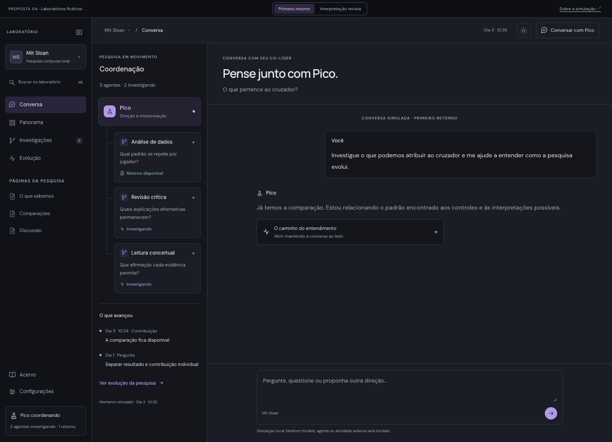
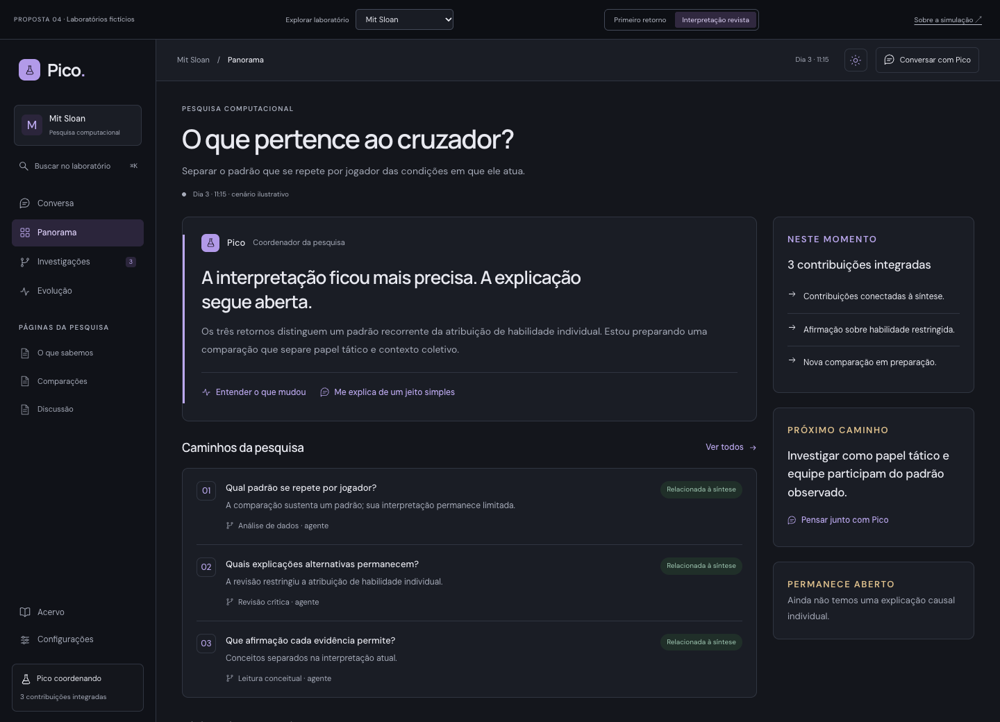

# Referências visuais da nova versão

As capturas abaixo preservam a direção visual discutida em 30 de setembro de
2026. Todo conteúdo de pesquisa, agentes e mensagens nelas é fictício. Elas
orientam apresentação e interação; não demonstram capacidades do modelo real.

## Direção aprovada

Grafite escuro, violeta discreto, DM Sans no texto e Manrope nos títulos. A
sidebar é recolhível e oferece troca de laboratório no cabeçalho, sem rail
externo. Conversa e acompanhamento aparecem lado a lado em telas amplas; no
celular, a navegação e o acompanhamento abrem sob demanda.

Na aplicação, manter controles reais de modelo, interrupção e jobs. Remover os
controles de cenário, o selo de proposta e textos de simulação do protótipo.
Na primeira entrega, o painel mostra a sessão e atividades existentes; filhos
de agentes dependem do [backlog de subagentes](subagentes.md).

## Capturas de referência

| Arquivo | Referência |
| --- | --- |
| [Conversa](referencias/conversa.png) | Shell mais recente, sem rail, com acompanhamento à esquerda. |
| [Seletor de labs](referencias/seletor-labs.png) | Busca, seleção e acesso à criação pelo cabeçalho. |
| [Sidebar móvel](referencias/sidebar-mobile.png) | Navegação e identidade do lab em tela estreita. |
| [Panorama](referencias/panorama.png) | Hierarquia editorial, síntese e caminhos de aprofundamento. |
| [Evolução](referencias/evolucao.png) | Mudanças de entendimento e acesso às explicações. |
| [Página qualitativa](referencias/pagina-qualitativa.png) | Conteúdo de outro tipo de pesquisa usando a mesma linguagem visual. |

As três primeiras capturas refletem o último ajuste da sidebar. As demais
foram capturadas na etapa anterior de refinamento da paleta: usar seu conteúdo
central como referência e aplicar o shell mais recente. Estados de agentes são
ilustrativos e não devem ser preenchidos com dados inventados na aplicação.





## Protótipo interativo

O protótipo completo está fora da aplicação, em
`/Users/standard/projects/pico-ui-proposal-2026-09-30/`. O ponto de entrada atual
é `labs.html`; dados fictícios estão em `labs-data.js`.

Na máquina em que foi elaborado, pode ser aberto em
[Conversa do protótipo](http://127.0.0.1:5186/labs.html?lab=sloan&moment=0&view=chat)
enquanto o servidor local estiver ativo. Para servi-lo novamente, se a pasta
estiver disponível e a porta livre:

```sh
python3 -m http.server 5186 --bind 127.0.0.1 --directory /Users/standard/projects/pico-ui-proposal-2026-09-30
```

Esse caminho e a URL são locais; as capturas desta pasta continuam disponíveis
em outros checkouts. O código do protótipo e suas folhas de estilo acumuladas
não são a arquitetura a transportar para React.

As fontes e suas licenças estão em `assets/fonts/` no protótipo. A issue 01
incorpora os arquivos necessários à aplicação com as respectivas licenças.

## Cenários para avaliar generalidade

| Cenário | O que observar |
| --- | --- |
| Computacional | Resultado disponível com interpretação ainda limitada. |
| Qualitativo | Leituras divergentes sem consenso artificial. |
| Teórico | Refutação e preservação de tentativas encerradas. |
| Bancada | Dependência de coleta humana e dados insuficientes. |
| Laboratório vazio | Início pela conversa, sem agentes ou descobertas artificiais. |

As verificações interativas anteriores dizem respeito ao protótipo. A
aplicação real precisa ser verificada nas issues correspondentes e na
validação integrada da issue 14.
